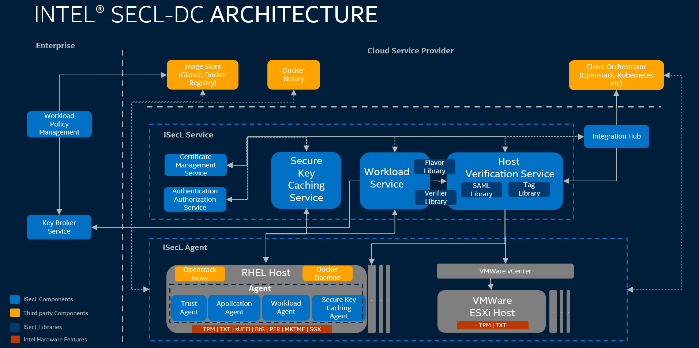

# Intel<sup>®</sup> Security Libraries for Data Center (Intel<sup>®</sup> SecL-DC)

Intel<sup>®</sup> Security Libraries for Data Center (Intel<sup>®</sup> SecL-DC) enables security use cases for data center using Intel<sup>®</sup> 
hardware security technologies.
  
Hardware-based cloud security solutions provide a higher level of protection as compared to software-only security 
measures. There are many Intel platform security technologies, which can be used to secure customers' data. Customers 
have found adopting and deploying these technologies at a broad scale challenging, due to the lack of solution 
integration and deployment tools. Intel<sup>®</sup> Security Libraries for Data Centers (Intel<sup>®</sup> SecL - DC) was built to aid our 
customers in adopting and deploying Intel Security features, rooted in silicon, at scale.

Intel<sup>®</sup> SecL-DC is an open-source remote attestation implementation comprising a set of building blocks that utilize 
Intel Security features to discover, attest, and enable critical foundation security and confidential computing 
use-cases. It applies the remote attestation fundamentals and standard specifications to maintain a platform data 
collection service, and an efficient verification engine to perform comprehensive trust evaluations. These trust 
evaluations can be used to govern different trust and security policies applied to any given workload.

For more details please visit : https://01.org/intel-secl

## Architecture

The below diagram depicts the high level architecture of the Intel<sup>®</sup>SecL-DC,



## Components and Repositories

| Component | Abbreviation | Github Repository URL |
|-----------|--------------|-----------------------|
| Certificate Management Service           | CMS         | [https://github.com/intel-secl/certificate-management-service](https://github.com/intel-secl/certificate-management-service) |
| Authentication and Authorization Service | AAS         | [https://github.com/intel-secl/authservice](https://github.com/intel-secl/authservice) |
| Workload Policy Management               | WPM         | [https://github.com/intel-secl/workload-policy-manager](https://github.com/intel-secl/workload-policy-manager) |
| Key Broker Service                       | KBS         | [https://github.com/intel-secl/key-broker-service](https://github.com/intel-secl/key-broker-service) |
| Trust Agent                              | TA          | [https://github.com/intel-secl/go-trustagent](https://github.com/intel-secl/go-trustagent) |
| Application Agent                        | AA          | [https://github.com/intel-secl/go-trustagent/tree/master/tboot-xm](https://github.com/intel-secl/go-trustagent/tree/master/tboot-xm) |
| Workload Agent                           | WLA         | [https://github.com/intel-secl/workload-agent](https://github.com/intel-secl/workload-agent) |
| Host Verification Service                | HVS         | [https://github.com/intel-secl/intel-secl/tree/master/pkg/hvs](https://github.com/intel-secl/intel-secl/tree/master/pkg/hvs) |
| Integration Hub                          | iHUB        | [https://github.com/intel-secl/intel-secl/tree/master/pkg/ihub](https://github.com/intel-secl/intel-secl/tree/master/pkg/ihub) |
| Workload Service                         | WLS         | [https://github.com/intel-secl/workload-service](https://github.com/intel-secl/workload-service) |
| Isecl k8s extensions                     | --          | [https://github.com/intel-secl/k8s-extensions](https://github.com/intel-secl/k8s-extensions) |
| SGX Caching Service                      | SCS         | [https://github.com/intel-secl/sgx-caching-service](https://github.com/intel-secl/sgx-caching-service) |
| SGX Quote Verification Service           | SQVS        | [https://github.com/intel-secl/sgx-verification-service](https://github.com/intel-secl/sgx-verification-service) |
| SGX Host Verification Service            | SHVS        | [https://github.com/intel-secl/sgx-hvs](https://github.com/intel-secl/sgx-hvs) |
| SGX Hub                                  | sHUB        | [https://github.com/intel-secl/sgx-ah](https://github.com/intel-secl/sgx-ah) |
| SGX Agent                                | AGENT       | [https://github.com/intel-secl/sgx_agent](https://github.com/intel-secl/sgx_agent) |
| SKC Client/Library                       | SKC Library | [https://github.com/intel-secl/skc_library](https://github.com/intel-secl/skc_library) |

## Getting Started

### Build Instructions: 
Intel<sup>®</sup> SecL-DC is provided as reference code and is also extensible to include any future security use cases and 
technologies. To build components necessary to try out different use cases, please follow instructions here,

[https://github.com/intel-secl/build-manifest/](https://github.com/intel-secl/build-manifest/)

It makes use of repo tool which simplifies your all efforts to clone and build multiple repos. Also, it helps 
to build latest **v3.0.0** version of Intel<sup>®</sup> SecL-DC with as simple instruction as,

```shell
# repo init -U <build-repo-url> -b <release-tag> -m <usecasemanifest>

example:

# repo init -u https://github.com/intel-secl/build-manifest.git -b refs/tags/v3.0.0 -m manifest/vmc.xml
```

### Product Guide: 
For more details on the product, installation and deployment strategies, please go through following, (Refer to latest and use case wise guide)

[https://01.org/intel-secl/documentation/intel%C2%AE-secl-dc-product-guide](https://01.org/intel-secl/documentation/intel%C2%AE-secl-dc-product-guide)

### Release Notes: 
[https://01.org/intel-secl/documentation/intel%C2%AE-secl-dc-release-notes](https://01.org/intel-secl/documentation/intel%C2%AE-secl-dc-release-notes)

### Issues: 
Feel free to raise build, deploy or even runtime issues here,

[https://github.com/intel-secl/intel-secl/issues](https://github.com/intel-secl/intel-secl/issues)

***NOTE:** Instructions specific to [build](./Monorepo-Readme.md) components only in monorepo*